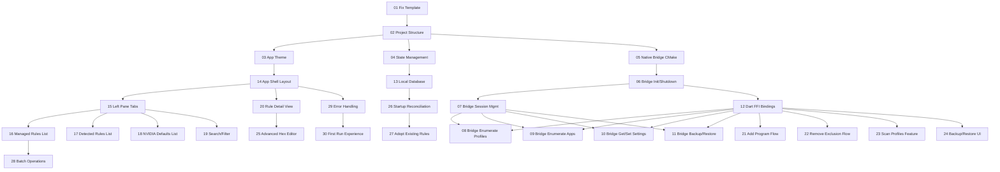

# Feature Breakdown for ShadowPlay Toggler

The project in `design.md` describes a Flutter Windows desktop app with a native C/C++ NVAPI bridge. The current codebase is just the default Flutter counter template (with a broken `main.dart`). I will create ~25 small plan files in `plans/`, ordered by dependency so subagents can build them roughly in sequence.

## Dependency Graph (simplified)

## Plan Files to Create

### Foundation (01-04)

- **01-fix-template-and-setup.md** - Fix broken main.dart, remove counter demo, clean slate
- **02-project-structure.md** - Create lib/ folder structure (models, services, screens, widgets, providers)
- **03-app-theme.md** - Dark charcoal + NVIDIA green theme, typography, button styles
- **04-state-management.md** - Add Riverpod, set up core providers

### Native C/C++ Bridge (05-11)

- **05-native-bridge-cmake-setup.md** - CMake config for shadowplay_bridge.dll, NVAPI SDK integration
- **06-native-bridge-init-shutdown.md** - NvAPI_Initialize / NvAPI_Unload wrapper functions
- **07-native-bridge-session-management.md** - DRS session create/load/save/destroy
- **08-native-bridge-enumerate-profiles.md** - Enumerate all profiles + profile info
- **09-native-bridge-enumerate-apps.md** - Enumerate applications within a profile
- **10-native-bridge-get-set-settings.md** - Get/set/delete/restore DWORD settings
- **11-native-bridge-backup-restore.md** - Export/import DRS settings to/from file

### Dart FFI Layer (12)

- **12-dart-ffi-bindings.md** - All FFI bindings from Dart to the native bridge DLL

### Data Layer (13)

- **13-local-database.md** - SQLite/Hive schema for managed rules, CRUD operations

### UI Shell (14-15)

- **14-app-shell-layout.md** - Two-pane layout scaffold with top toolbar
- **15-left-pane-tabs.md** - Tab bar: Managed / Detected Existing Rules / NVIDIA Defaults

### UI Lists (16-19)

- **16-managed-rules-list.md** - Managed tab: list items with status badges
- **17-detected-rules-list.md** - Detected Existing Rules tab
- **18-nvidia-defaults-list.md** - NVIDIA Defaults tab (collapsed/secondary)
- **19-search-filter.md** - Search bar and filtering across all tabs

### UI Detail (20, 25)

- **20-rule-detail-view.md** - Right pane: app name, profile, status, source badges
- **25-advanced-hex-editor.md** - Raw hex value editor for setting 0x809D5F60

### Feature Flows (21-24)

- **21-add-program-flow.md** - File picker, profile lookup, create/update rule
- **22-remove-exclusion-flow.md** - Restore default / delete managed profile
- **23-scan-profiles-feature.md** - Full DRS scan, populate detected + defaults tabs
- **24-backup-restore-feature.md** - Backup/restore UI + DRS file operations

### Lifecycle & Polish (26-30)

- **26-startup-reconciliation.md** - Reconcile local DB with driver state on launch
- **27-adopt-existing-rules.md** - Adopt unmanaged rules into Managed (post-MVP)
- **28-batch-operations.md** - Batch enable/disable managed rules (post-MVP)
- **29-error-handling-notifications.md** - Snackbars, dialogs, error boundaries
- **30-first-run-experience.md** - Empty state, first-scan prompt, backup offer

