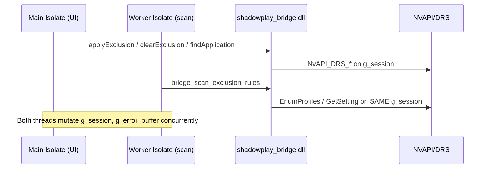

# Comprehensive Code Review: shadowplay_toggler

## 1. Overall assessment

The repo is in surprisingly good shape for a desktop app that straddles Flutter, sqflite, and NVAPI:

- Clean layered architecture (widgets → providers → services → FFI → C++).
- FFI heap/static contract is consistent on the Dart side — every heap JSON path goes through `_readJson` + `bridge_free_json`.
- Reconciliation, scan, adopt, batch, backup flows each have a dedicated service, which keeps testing surfaces small.
- `main.dart` does a good job with `runZonedGuarded` + framework + platform error capture + log tee.

The issues below are real but fixable without structural upheaval. There is **one architectural concern** (NVAPI thread-safety under the scan isolate) that deserves a deliberate design decision.

## 2. Architectural concern: cross-isolate NVAPI use

`ScanService` runs `bridge_scan_exclusion_rules` on a worker isolate:

```12:20:lib/services/scan_service.dart
String? _scanInIsolate(int settingId) {
  final bridge = BridgeFfi();
  return bridge.scanExclusionRules(settingId);
}
```

Flutter's `Isolate.run` runs this on a different OS thread. `LoadLibrary` returns the same HMODULE as the main isolate, so the worker and main threads both touch the single `g_session`, `g_error_buffer`, and `g_backup_path_buffer` in [native/bridge.cpp](native/bridge.cpp):

```32:35:native/bridge.cpp
static bool g_initialized = false;
static NvDRSSessionHandle g_session = 0;
static char g_error_buffer[256] = {};
static char g_backup_path_buffer[MAX_PATH * 2] = {};
```

Meanwhile [`lib/widgets/app_toolbar.dart`](lib/widgets/app_toolbar.dart) only gates the Scan button on `isScanningProvider` — Add Program, Backup, toggle, adopt, remove all stay clickable during a scan.



NVAPI/DRS does not document thread-safety for concurrent session use, and the shared static buffers *are* definitely unsafe under concurrent access.

**Recommended fix (scoped, non-invasive):** add a Dart-side `Mutex`/`Completer` in `NvapiService` (or a dedicated `BridgeDispatcher`) that serializes all calls, and teach the worker isolate to take that same lock via a port-based queue. Concretely:

- Keep the scan on an isolate (isolating the long NVAPI walk keeps UI responsive).
- Route *every* bridge call through a single-writer queue owned by the main isolate. The worker posts scan requests via `SendPort`; the main isolate forwards to the DLL and posts results back. This means the DLL is only ever entered from one thread at a time.
- Alternative lighter touch: keep both isolates calling FFI directly but add a Dart-level `Mutex` in `NvapiService`, and disable all NVAPI-touching UI actions while a scan is in flight (`isScanningProvider == true`).

If we want to keep the current model short-term, the minimum safe patch is:
- Wrap every `NvapiService` method in a `Future`-chained `Lock` so two calls can't overlap inside the same isolate.
- Disable Add/Backup/Toggle/Adopt buttons while `isScanningProvider || isReconcilingProvider`.

## 3. Verified findings (by severity)

### 3.1 Critical / High

Each entry lists file:line and is keyed as F-### for the fix plan in §4.

- **F-01 · Cross-isolate NVAPI access** — see §2. Files: [`lib/services/scan_service.dart`](lib/services/scan_service.dart#L12-L20), [`native/bridge.cpp`](native/bridge.cpp#L32-L35).
- **F-02 · `ErrorBoundary` mutates `ErrorWidget.builder` on every build** — side-effect inside `build()` is global process state, not subtree-scoped. Assign once from `main.dart`. [`lib/widgets/error_boundary.dart:17-20`](lib/widgets/error_boundary.dart#L17-L20).
- **F-03 · Reset Database leaves stale in-memory selection & scan snapshots** — [`lib/screens/settings_screen.dart:384-393`](lib/screens/settings_screen.dart#L384-L393) clears detected/defaults/exclusion state + refreshes managed, but does not clear `selectedRuleProvider`, `multiSelectModeProvider`, `selectedRuleIdsProvider`, `lastScanResultProvider`, or `lastReconciliationProvider`. Combined with F-04, user can edit a "ghost" rule row.
- **F-04 · `_effectiveManaged` synthesizes a fake `ManagedRule` when the row is gone** — [`lib/widgets/right_pane.dart:181-197`](lib/widgets/right_pane.dart#L181-L197) invents a row with `DateTime.now()` timestamps on every rebuild. Should clear selection / render an "removed" state instead.
- **F-05 · Adopt All does not clear `selectedRuleProvider`** — [`lib/widgets/adopt_rule_button.dart:342-383`](lib/widgets/adopt_rule_button.dart#L342-L383) clears the Detected list; if the user had one of those rules selected, the detail pane is now showing an ExclusionRule that is no longer in any list.
- **F-06 · Reconciliation fetches `managed` rules twice, racing with user writes** — [`lib/services/scan_service.dart:90`](lib/services/scan_service.dart#L90) inside scan, and [`lib/services/reconciliation_service.dart:58`](lib/services/reconciliation_service.dart#L58) right after. Between the two, a user can add/remove a rule, so the classification buckets inside `scan` disagree with the `managed` list used for `statuses`. Solution: return managed-snapshot from scan, or pass it in.
- **F-07 · `ReconciliationService.statuses` is dead data** — the per-rule `inSync/drifted/orphaned/needsReapply` map at [`reconciliation_service.dart:93-107`](lib/services/reconciliation_service.dart#L93-L107) is computed but no widget reads it. The UI's drift/orphan badges come only from `lastScanResultProvider` (user-initiated scan). After startup reconciliation alone, managed rules show no status. Either wire the status map into the Managed tile or delete it.
- **F-08 · `lastDriverVersion` is read but never written** — [`reconciliation_service.dart:38-39`](lib/services/reconciliation_service.dart#L38-L39) reads it; no `setValue(ReconciliationKeys.lastDriverVersion, ...)` exists. Either write it or remove the key.
- **F-09 · `NvapiReady` listener stays set after first transition** — [`lib/screens/home_screen.dart:57-59,175-179`](lib/screens/home_screen.dart#L57-L59) sticky `_reconciliationStarted` never resets. If NVAPI cycles Ready→Error→Ready (e.g. driver recovery), reconciliation does not re-run. Also `ref.listen` is registered inside `build`.
- **F-10 · BatchActionBar optimistic state ignores per-exe failures** — [`lib/widgets/batch_action_bar.dart:59-68`](lib/widgets/batch_action_bar.dart#L59-L68) flips `profileExclusionStateProvider` for every selected rule even if some failed. `BatchResult.errors` is `List<String>` (`"{exeName}: {msg}"`), so it can't be filtered. Fix: extend `BatchResult` with `Set<String> failedExePaths` (or `Map<String, String> errorsByExePath`) and filter the optimistic update.
- **F-11 · `NvapiService._parseJson` swallows `FormatException` up the call chain** — [`lib/services/nvapi_service.dart:39-43`](lib/services/nvapi_service.dart#L39-L43) calls `jsonDecode` with no try/catch; callers like [`add_program_service.preview`](lib/services/add_program_service.dart#L102-L112), [`adopt_rule_service.adoptRule`](lib/services/adopt_rule_service.dart#L47-L52), [`profile_exclusion_state_provider._queryLive`](lib/providers/profile_exclusion_state_provider.dart#L103-L129) only catch `NvapiBridgeException`. A malformed bridge response crashes instead of surfacing a clean error.
- **F-12 · `profileExclusionStateProvider.refreshAll` races** — [`profile_exclusion_state_provider.dart:88-94`](lib/providers/profile_exclusion_state_provider.dart#L88-L94) runs sequential NVAPI queries with no cancellation / generation token. A second concurrent call (e.g. user triggers scan while a refresh is in flight) writes stale results.
- **F-13 · `rules_export_service` path normalization mismatch** — [`rules_export_service.dart:89`](lib/services/rules_export_service.dart#L89) calls `getRuleByExePath(entry.exePath)` **before** `commit`, but [`add_program_service.commit`](lib/services/add_program_service.dart#L141) normalizes via `p.normalize`. Case/separator differences in export files cause wrong `imported` vs `alreadyManaged` counts. Also `BackupService.deleteBackup` has no path-prefix validation (arbitrary file delete if callers pass user input) — [`backup_service.dart:94-98`](lib/services/backup_service.dart#L94-L98).
- **F-14 · `RemoveExclusionService` silently skips DB delete when `rule.id == null`** — [`remove_exclusion_service.dart:57-77`](lib/services/remove_exclusion_service.dart#L57-L77). `unmanage` in `ManagedRuleActionsService` handles this by falling back to `deleteRuleByExePath`; `removeExclusion` does not, yet still returns `removedFromLocalDb: true`.
- **F-15 · Native static buffers are not thread-safe** — [`native/bridge.cpp:153-165`](native/bridge.cpp#L153-L165) `g_error_buffer`, `native/bridge.cpp:999-1023` `g_backup_path_buffer`. Will tear if two threads ever call into the DLL concurrently (today: scan isolate + main isolate). Use thread-local buffers or caller-provided buffers.
- **F-16 · AppToolbar / Home actions not gated during scan or reconciliation** — [`lib/screens/home_screen.dart:149-169`](lib/screens/home_screen.dart#L149-L169) only asserts `NvapiReady`. Add a `isScanningProvider || isReconcilingProvider` guard on Add Program, Backup, and managed-row mutations. Pairs with F-01/F-15.

### 3.2 Medium

- **F-17 · `utf8_to_wide` / `wide_to_utf8` don't check `MultiByteToWideChar` / `WideCharToMultiByte` return** — [`native/bridge.cpp:54-69`](native/bridge.cpp#L54-L69). Invalid UTF-8 silently becomes an empty string; NVAPI operates on the empty path.
- **F-18 · `bridge_find_application` / `bridge_clear_exclusion` ignore `NvAPI_DRS_GetProfileInfo` return** — [`native/bridge.cpp:336-338`](native/bridge.cpp#L336-L338) and [`:665-667`](native/bridge.cpp#L665-L667). If it fails, we serialize partially uninitialized `profileInfo` into the JSON response.
- **F-19 · `bridge_scan_exclusion_rules` cannot distinguish "not set" from "error"** — [`native/bridge.cpp:858-859`](native/bridge.cpp#L858-L859) `continue`s on every non-OK status. Surface real errors in the scan JSON.
- **F-20 · `bridge_is_initialized` is never called from Dart** — no runtime guard before any operation; relies entirely on UI state.
- **F-21 · Settings provider sets state before awaiting persist** — [`lib/providers/settings_provider.dart:24-27`](lib/providers/settings_provider.dart#L24-L27). If `setBool` throws, UI shows the new value but disk has the old one.
- **F-22 · Reconciliation `setValue` pair not transactional** — [`reconciliation_service.dart:67-71,109-113`](lib/services/reconciliation_service.dart#L67-L71) writes `drs_profile_hash` and `last_reconcile_at` separately. Crash in between leaves inconsistency.
- **F-23 · `searchProvider` has no debouncing** — [`lib/providers/search_provider.dart`](lib/providers/search_provider.dart) updates on every keystroke; `filteredManagedRulesProvider` and `filteredDetectedRulesProvider` re-filter on every frame. Add a small debounce notifier or `Timer` in the notifier.
- **F-24 · `RuleListTile` watches `selectedRuleProvider` per row** — [`lib/widgets/rule_list_tile.dart:62-65`](lib/widgets/rule_list_tile.dart#L62-L65). Every selection change rebuilds every visible row. Lift selection to a parent, use `select`, or compare a narrower field.
- **F-25 · LogsScreen copies the full buffer on every new line** — [`lib/screens/logs_screen.dart:28-36`](lib/screens/logs_screen.dart#L28-L36) calls `setState` with a fresh `snapshot()` on every event. Replace with an incremental append model, or throttle via a `Timer.periodic`.
- **F-26 · `LogBuffer.clear()` does not emit on the stream** — [`lib/services/log_buffer.dart:68-70`](lib/services/log_buffer.dart#L68-L70). Subscribers don't re-paint until the next `add`.
- **F-27 · Dismissing `ReconciliationBanner` clears `lastReconciliationProvider`** — [`lib/widgets/reconciliation_banner.dart`](lib/widgets/reconciliation_banner.dart) sets the provider to null; any future telemetry/diagnostics reading "last reconciliation" loses access. Store a separate `dismissed` flag.
- **F-28 · `ExclusionRule ==` excludes `currentValue`** — [`lib/models/exclusion_rule.dart:69-81`](lib/models/exclusion_rule.dart#L69-L81). Selection can lag list rows' `currentValue`. Minor because most of the detail pane reads live state from `profileExclusionStateProvider`.
- **F-29 · Inconsistent error surfaces** — raw `ScaffoldMessenger.showSnackBar` in [`home_screen._assertNvapiReady`](lib/screens/home_screen.dart#L143-L145), [`_onAddProgram`](lib/screens/home_screen.dart#L157), [`scan_controller.dart`](lib/widgets/scan_controller.dart) vs themed `AppSnackbar`/`NotificationService` elsewhere. Unify.
- **F-30 · `Multi-select` mode not cleared on tab change** — `multiSelectModeProvider` is global. Leaving the Managed tab with multi-select active preserves selection; returning shows stale chips.
- **F-31 · `BackupDialog` layout: `Column(min) + Flexible + scroll`** — [`lib/widgets/backup_dialog.dart:103-138`](lib/widgets/backup_dialog.dart#L103-L138) can fail to bound on small windows. Use `Expanded` inside a `SizedBox(maxHeight:)`.
- **F-32 · Reconciliation `hasAnyIssue` name is misleading** — [`lib/models/reconciliation_result.dart:89-95`](lib/models/reconciliation_result.dart#L89-L95) does not include `fatalError` or `warnings`. Rename or widen.
- **F-33 · `warnings` field of `ReconciliationResult` never populated** — dead API. Remove or wire.
- **F-34 · Auto-scan `.catchError((_) => false)`** — [`home_screen.dart:120-121`](lib/screens/home_screen.dart#L120-L121) swallows the error entirely. Log via `LogBuffer.add(LogLevel.warn, …)` at minimum.
- **F-35 · Global error handler emits a snackbar even in debug** — [`main.dart:95-109`](lib/main.dart#L95-L109) always invokes `NotificationService.showError`, even though debug already runs `defaultOnError` (red screen). Gate the snackbar on `!kDebugMode`.

### 3.3 Low / Nit (one-liners, polish)

- **F-36** · `copyWith` on nullable fields (`ManagedRule.previousValue`, `ExclusionRule.previousValue`, `ReconciliationResult.fatalError`) cannot express "set to null". Use sentinel pattern only where needed.
- **F-37** · `RulesExportDocument._parseIntendedValue` silently returns `0x10000000` on unparsable input — throw `FormatException` so the import UI can show "bad file".
- **F-38** · `AppException` has no `cause`/`StackTrace`. Optional enhancement.
- **F-39** · `ProfileInfo.fromJson` uses strict `as int?`; defensive `(v as num?)?.toInt()` avoids double-to-int pitfalls.
- **F-40** · `ScannedRule.toExclusionRule` drops `appIsPredefined` (only `profileIsPredefined` → `isPredefined`). Minor semantic ambiguity.
- **F-41** · `bridge.cpp:build_error_json` does not escape the `error` string. Today only literals — future footgun if dynamic strings ever land there.
- **F-42** · `escape_json_string` only handles a subset of C0 controls. Other bytes like `0x01` become invalid JSON.
- **F-43** · `native/CMakeLists.txt` relies on transitive linkage for `shell32`. Add explicit `target_link_libraries(... shell32)`.
- **F-44** · `flutter_window.cpp` `WM_FONTCHANGE` branch does not guard `flutter_controller_`. Add null-check.
- **F-45** · Missing tooltips on Scan / Add / Backup icon buttons in `AppToolbar`. Add `Tooltip` and register a `Shortcuts` map for Ctrl+Shift+S (scan), Ctrl+N (add), Ctrl+B (backup).
- **F-46** · `_HeaderRow` in `right_pane.dart:599-604`: long `exePath` has no `overflow: TextOverflow.ellipsis` / `maxLines`.
- **F-47** · `ConfirmationDialog` uses default `barrierDismissible: true`; destructive confirmations (Reset DB, Delete Profile, batch ops) should probably be `false`.
- **F-48** · `ExeDropTarget` only validates extension; fine for desktop but worth a doc note.
- **F-49** · `main.dart` `FlutterError.onError` handler calls `NotificationService.showError` even in debug (see F-35).
- **F-50** · `ReconciliationService._stringHash` masks to 63 bits — stable but not strict FNV-1a semantics. Change comment to "modified FNV" or mask to 64 bits.

## 4. Fix plan (phased)

Each fix references the F-### labels above. Phases are suggested, not mandatory — user can pick any subset.

### Phase 0 · Safety net (do first)

- Add explicit action gating: disable Add/Backup/Toggle/Adopt/Remove/Batch while `isScanningProvider || isReconcilingProvider`. (F-16)
- Move `ErrorWidget.builder = _buildFallback;` out of `build` into `main()`. (F-02)
- Gate debug-mode duplicate snackbar in global error handler. (F-35)

### Phase 1 · Correctness (critical/high)

1. **NVAPI serialization.** Add a private `async.Lock`-backed dispatch in `NvapiService`, and a `runOnBridgeMain` helper that the scan worker posts through (see §2). Then mark all `NvapiService` public methods `Future<...>` and await the lock. (F-01, F-15)
2. **Fix dangling state on destructive actions.** In `_ResetDatabaseSection._onResetPressed` + `AdoptAllButton._onAdoptAll`, also clear `selectedRuleProvider`, `multiSelectModeProvider`, `selectedRuleIdsProvider`, `lastScanResultProvider`, `lastReconciliationProvider`. Introduce a single helper `resetTransientState(WidgetRef)` so every destructive flow can share it. (F-03, F-05)
3. **Replace `_effectiveManaged` synthesized row** with one of: (a) clear the selection when no row matches, (b) render an explicit "rule was removed" panel, (c) keep synthesized row but freeze its timestamps. Pick (a) as the default. (F-04)
4. **Reconciliation managed-snapshot.** Extend `ScanResult` (or add `_ClassificationBuckets.managed`) to carry the `List<ManagedRule>` snapshot that the scan already loaded, and make `ReconciliationService.reconcile` use that snapshot instead of a second `getAllRules()` call. (F-06)
5. **Decide on `statuses`.** Either: (a) plumb `ReconciliationResult.statuses` into `managedRulesProvider` / `ManagedRulesTab` so drift/orphan badges render after startup reconciliation too, or (b) drop the field and document that badges require an explicit scan. Recommend (a). (F-07)
6. **Write `lastDriverVersion`.** Populate from a new `bridge_get_driver_version` (optional new bridge call), or remove the key. Short-term: remove to kill the dead read. (F-08)
7. **Fix `NvapiReady` listener**: reset `_reconciliationStarted = false` when state leaves `NvapiReady`, and move the `ref.listen` to `initState` via `ref.listenManual`. (F-09)
8. **`BatchResult` shape.** Add `Map<String, String> errorsByExePath` (or `Set<String> failedExePaths`), populated by `BatchService`. Update `BatchActionBar._runBatch` to only `setForExe` for non-failed paths. Keep legacy `errors: List<String>` for the summary dialog. (F-10)
9. **Robust JSON parsing.** In `NvapiService._parseJson` and the two raw `jsonDecode` call sites (`getAllProfiles`, `getProfileApps`, `getBaseProfileApps`), wrap in `try/catch(FormatException)` and rethrow as `NvapiBridgeException`. (F-11)
10. **Cancellation in `profileExclusionStateProvider.refreshAll`.** Add an `int _generation` counter; capture at the top, bump on cancel / new call, discard writes whose generation is stale. (F-12)
11. **Path normalization in rules export.** In `RulesExportService.importFromFile`, normalize `entry.exePath` via `p.normalize` before `getRuleByExePath` and `commit`. (F-13)
12. **`BackupService.deleteBackup` guard.** Resolve the canonical path and verify it lives under `defaultBackupDirectory()` before deleting. (F-13)
13. **`RemoveExclusionService` id-null fallback.** Mirror `unmanage`: `if (rule.id != null) deleteRule(id!); else deleteRuleByExePath(rule.exePath)`. (F-14)

### Phase 2 · Medium-severity polish

- UTF-8 conversion failure handling in `bridge.cpp` (F-17) and checked `GetProfileInfo` everywhere (F-18).
- Distinguish "not present" vs "error" in scan per-profile loop (F-19).
- Optional `bridge_is_initialized` guards in `NvapiService` (F-20).
- Settings provider: await persist before setting state, or revert on failure (F-21).
- Wrap reconciliation `setValue` pair in a `db.transaction` (F-22).
- Debounce `searchProvider` (F-23).
- `RuleListTile` selection via `ref.watch(selectedRuleProvider.select(...))` or lifted parent (F-24).
- `LogsScreen`: append instead of rebuilding the full list; throttle to ≤ 60 Hz (F-25).
- `LogBuffer.clear()` emits a sentinel event (F-26).
- `ReconciliationBanner` dismiss: local `dismissed` state, keep provider intact (F-27).
- Use `NotificationService` everywhere (replace remaining `ScaffoldMessenger.showSnackBar` calls in `home_screen.dart`, `scan_controller.dart`, `logs_screen.dart`) (F-29).
- Clear multi-select on tab change (F-30).
- `BackupDialog` layout: `Expanded` + `SizedBox(maxHeight:)` (F-31).
- Rename / widen `hasAnyIssue` (F-32); remove or populate `warnings` (F-33).
- Log auto-scan failure instead of swallowing (F-34).

### Phase 3 · Nits

Batch the F-36…F-50 fixes as a single "polish" PR. Each is low risk and one-to-a-handful of lines.

## 5. Suggested refactors / reorganization

These are optional — they pay back cleanliness, not correctness.

- **`BridgeDispatcher` / `BridgeGateway` abstraction.** Sits above `NvapiService` and owns serialization + logging + thread-safety (see §2). Services keep their current API; the gateway is the only thing that actually holds an FFI handle. Makes testing trivial: fake gateway at the same level.
- **Unify action services under a common interface.** `AddProgramService.commit`, `AdoptRuleService.adoptAndAddExclusion`, `ManagedRuleActionsService._enable` all ultimately do "apply exclusion and upsert local row" with slightly different inputs. Collapse to one `ApplyExclusionService.apply(exePath, origin)` and let the other services delegate. Reduces three nearly-duplicate code paths to one; fixes the current drift where each applies subtly different `copyWith` updates.
- **`sourceType` → enum.** `ExclusionRule.sourceType` is a raw `String` ('managed', 'external', 'nvidia_default', 'inherited'). Replace with `enum ExclusionSource` + string codec at DB / JSON boundaries only.
- **Concentrate UI-state coupling.** Every destructive flow re-implements "clear selection, refresh managed, update live map". Extract `afterDestructiveMutation(ref, {List<String>? removedExePaths})` and have every callsite use it. Removes most of F-03/F-05-class bugs permanently.
- **Provider cleanup.** Move `lastScanAtProvider`, `lastScanResultProvider`, `lastReconciliationProvider`, `isScanningProvider`, `isReconcilingProvider` into a single `scan_state_provider.dart` (or a notifier holding all four). Today they're scattered across `scan_provider.dart` and `reconciliation_provider.dart`.
- **Explicit error type for bridge failures.** `NvapiBridgeException` is thrown for both native rc != 0 and JSON shape issues after F-11. Split into `NvapiNativeException` (status code) and `NvapiProtocolException` (decode/shape) so callers can render different UX.
- **Test coverage.** The `test/` dir exists but is small; the highest-value tests would be:
  - `ReconciliationService` — DRS reset path, per-rule status, snapshot consistency (regresses F-06/F-07).
  - `BatchService` + `BatchActionBar` — partial failure handling (F-10).
  - `RulesExportService.importFromFile` — path normalization round-trip (F-13).
  - `RemoveExclusionService` — id==null fallback (F-14).

## 6. Out-of-scope

- UX redesign / theming — no concerns found beyond long-path overflow.
- Performance profiling — flagged `RuleListTile` and `LogsScreen` as likely hotspots; defer until measured.
- NVAPI SDK bump — independent process described in README.